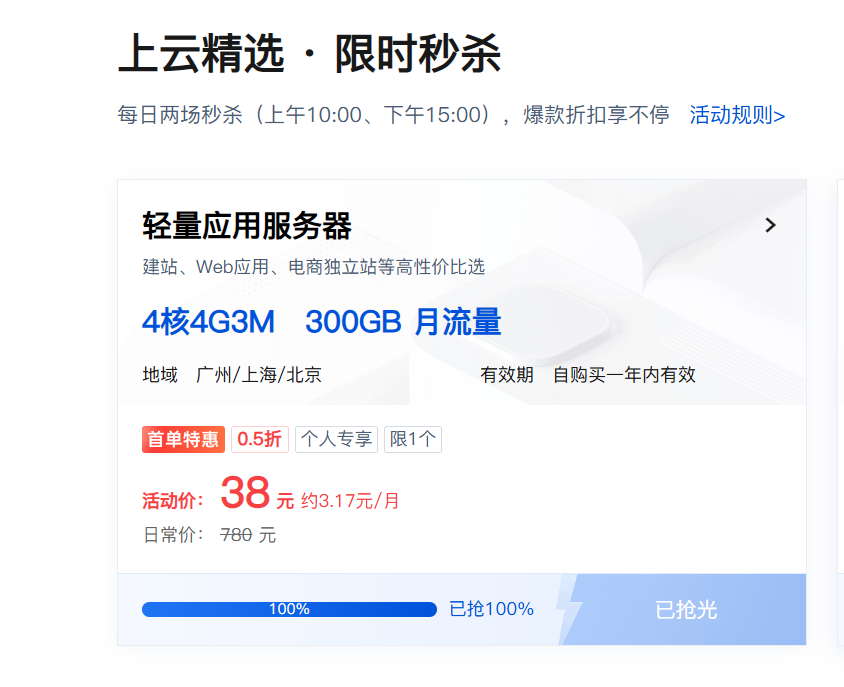

# 腾讯云服务器秒杀工具

## 📋 功能介绍

自动化抢购腾讯云限时秒杀服务器（轻量应用型服务器 4核4G3M
300GB 月流量）的Python脚本，支持并发抢购多个地域、库存检测、时间校准等功能。

## ✨ 主要特性
- 自动获取登录Cookies（支持扫码登录）
- 多地域并发抢购（华北、华东、华南）
- 实时库存检测
- 服务器时间校准
- 自动等待秒杀开始

## 📁 项目结构
```
tencentyun/
├── get_cookies.py      # Cookie获取脚本
├── snap_up_server.py    # 秒抢购主程序
└── cookies.json         # 存储登录Cookies
```

## 🚀 快速开始

### 1. 环境要求
- Python 3.8+（推荐 3.10+）
- 依赖库：
  ```
  playwright
  requests
  ```

### 2. 安装依赖
```bash
pip install playwright requests
playwright install chromium
```

### 3. 使用步骤

**第一步：获取Cookies**
```bash
python get_cookies.py
```
- 会自动打开浏览器，扫码登录腾讯云
- 登录成功后自动保存Cookies到cookies.json

**第二步：配置秒杀参数**
编辑 `snap_up_server.py`：
- 修改 `SECKILL_TIME_STR` 为目标秒杀时间
- 确认 `activity_id` 和 `act_id` 等参数正确（代码中已经配置好，只能使用此id）

**第三步：运行秒杀**
```bash
python snap_up_server.py
```
- 脚本会自动等待到秒杀时间
- 到达时间后并发抢购指定地域

## ⚙️ 配置说明

### 秒杀时间设置
在 `snap_up_server.py` 第198行：
```python
SECKILL_TIME_STR = "当天日期（2026-02-12） 15:00:00" 或者 "当天日期（2026-02-12） 10:00:00" # 修改为你的目标时间
```

### 地域配置
支持的地域ID：
- 1: 华北
- 4: 华东
- 8: 华南
- 9: 西南
- 5: 华中

修改第200行可调整抢购地域：
```python
region_ids = [1, 4, 8]  # 同时抢购华北、华东、华南
```

### CSRF Token
需要从浏览器开发者工具中实时获取并更新第35行的 `x-csrf-token` 值。
1.打开F12
2.点击network
3.随便点击一个check-available的数据包
4.查看请求头，找到`x-csrf-token`对应的值 （注意这个操作一定要是获取cookies时打开的浏览器中操作）

## ⚠️ 注意事项
1. 请确保 `cookies.json` 文件存在且有效
2. Cookies有时效性，建议秒杀前重新获取
3. x-csrf-token 会变化，秒杀前需更新
4. 建议提前测试脚本运行环境
5. 仅限个人学习使用，请勿用于商业用途

## 📝 工作流程
1. 加载Cookies建立会话
2. 循环检查服务器时间
3. 到达秒杀时间后并发调用抢购接口
4. 返回抢购结果

## 🔧 故障排查
- **Cookies过期**：重新运行 `get_cookies.py`
- **接口调用失败**：检查网络和参数配置
- **时间未到**：确认 `SECKILL_TIME_STR` 设置正确

## 📄 License
MIT License